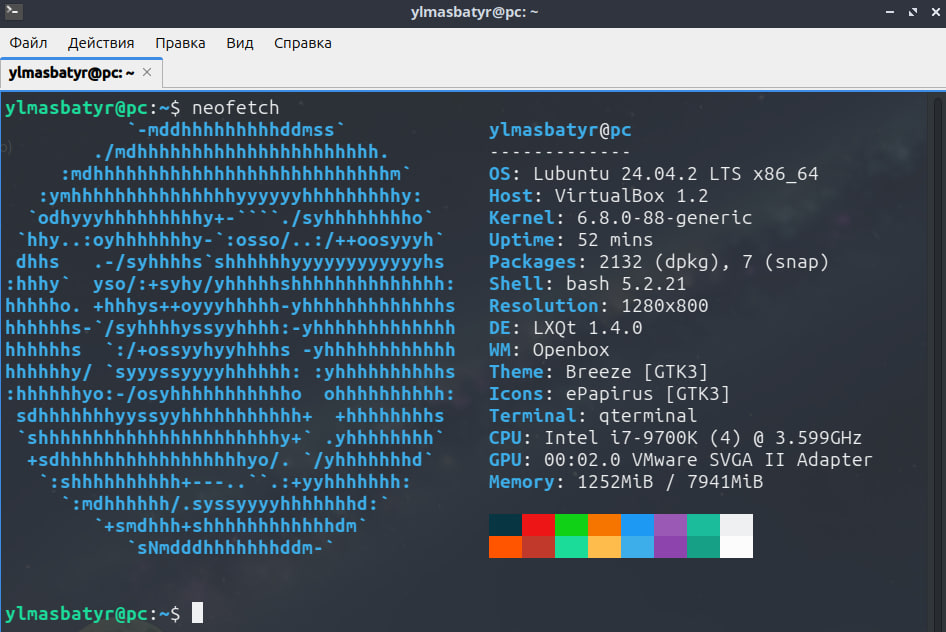
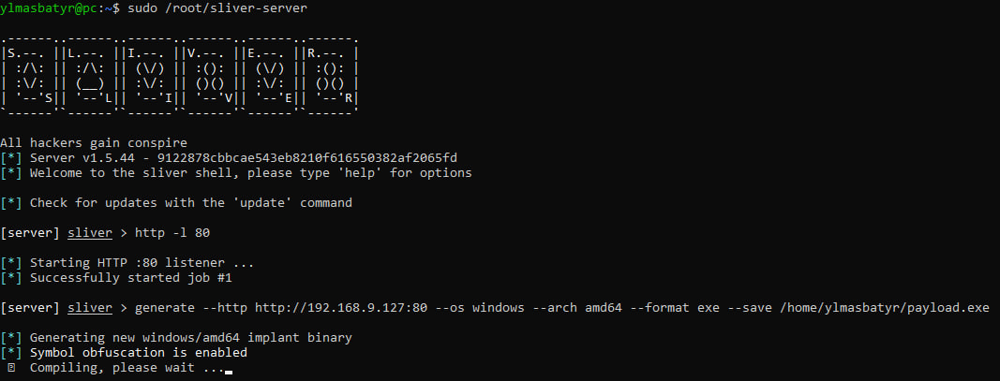
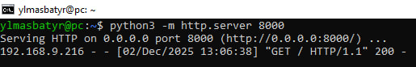
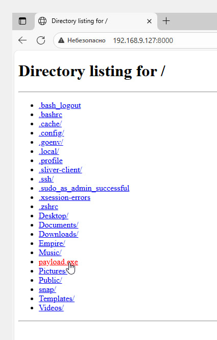
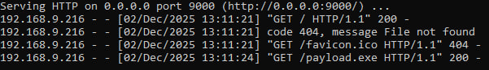
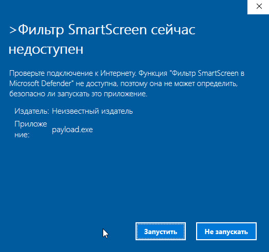
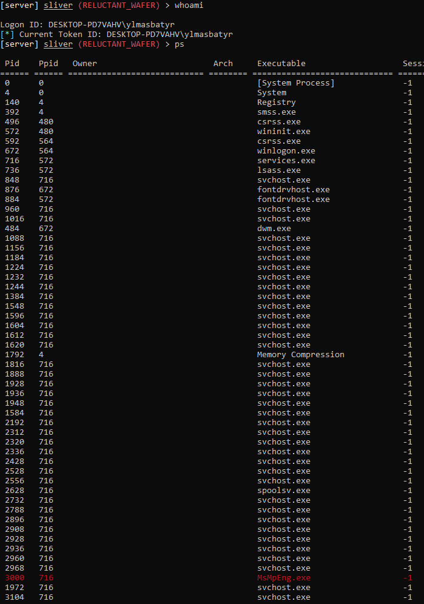
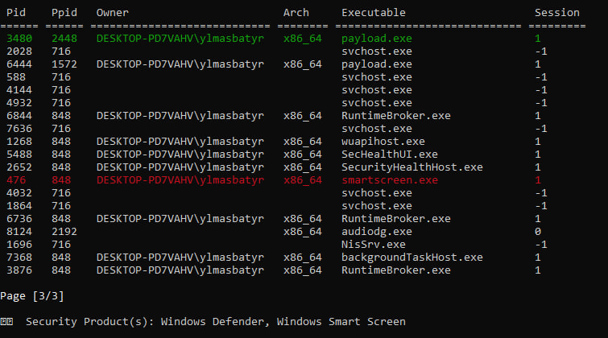

# Лабораторная работа №4
## Средства постэксплуатации

**Выполнили:** Ульмашев Ислам Русланович, Духнай Николай Евгеньевич  
**Группа:** 21-К-АС2  
**Дисциплина:** «Защита программного обеспечения защищенных автоматизированных систем»

---

### Цели работы

1. Изучить принципы работы Command&Control (C2) фреймворков
2. Развернуть C2-фреймворк на виртуальной машине
3. Настроить слушатель (listener) и сгенерировать полезную нагрузку (payload)
4. Запустить нагрузку на целевой системе и получить сессию
5. Ознакомиться с принципами работы фреймворка в "боевом режиме"

---

### Ход работы

#### 1. Подготовка виртуальных машин

Для выполнения работы создан лабораторный стенд из двух виртуальных машин. В качестве C2-сервера развёрнута Ubuntu Server 24.04 с установленной графической оболочкой Lubuntu для удобства управления. 

Целевой системой выбрана Windows 10, использован ранее подготовленный снимок виртуальной машины в ходе Лабораторной Работы №1. Обе системы настроены в режиме сетевого моста с адресами 192.168.9.127 (Ubuntu) и 192.168.9.216 (Windows), что обеспечило их прямое взаимодействие в изолированной среде.

#### 2. Развертывание C2-фреймворка

Первоначальная попытка установки Havoc C2 столкнулась с проблемами сборки зависимостей на Ubuntu 24.04. В качестве альтернативы выбран современный фреймворк Sliver C2, установленный через официальный скрипт одной командой. 

После установки запущена серверная часть Sliver и создан HTTP-слушатель на порту 80 для приёма обратных соединений от целевых систем.

#### 3. Генерация и доставка полезной нагрузки

С использованием встроенных средств Sliver сгенерирован исполняемый файл payload.exe для архитектуры x64 Windows. Для доставки нагрузки на целевую систему запущен простой HTTP-сервер средствами Python, через который файл был скачан с Windows-машины. 

Перед запуском отключены защитные механизмы Windows Defender и SmartScreen в учебных целях.

#### 4. Получение контроля над целевой системой

После запуска payload.exe на Windows-машине в консоли Sliver автоматически установлена активная сессия. Успешно выполнено подключение к сессии и получена информация о пользователе системы. Командой ps выведен полный список процессов, где идентифицированы два экземпляра запущенного агента. Проведён эксперимент по включению Windows Defender, который показал, что стандартная антивирусная защита не детектирует пассивный C2-агент при его работе.

#### 5. Исследование возможностей постэксплуатации

На примере полученной сессии изучен базовый функционал постэксплуатации: сбор информации о системе, мониторинг процессов, проверка учетных записей. Sliver продемонстрировал возможности скрытого управления целевой системой через HTTP-канал, маскирующийся под обычный веб-трафик, что усложняет его обнаружение сетевыми системами защиты.

---

### Выводы

Современные C2-фреймворки представляют собой развитые инфраструктурные решения, обеспечивающие устойчивое управление скомпрометированными системами через различные каналы связи с применением техник обфускации.Стандартные средства защиты Windows показали ограниченную эффективность против пассивных C2-агентов, обнаруживая угрозу преимущественно на этапе загрузки файла через механизмы репутации, но не в процессе его выполнения. Полученные практические навыки позволяют лучше понимать архитектуру современных угроз и важность комплексного подхода к защите, сочетающего сигнатурный анализ с мониторингом поведения процессов и сетевой активности.
